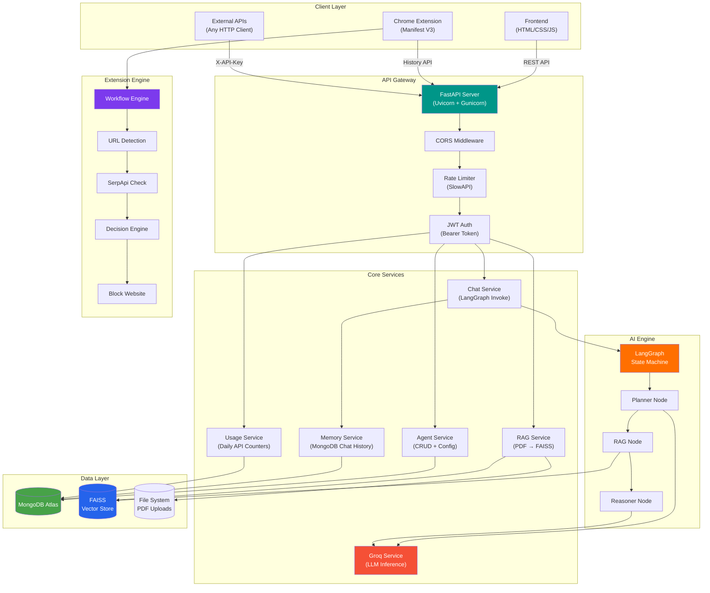
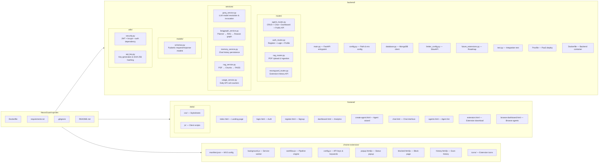
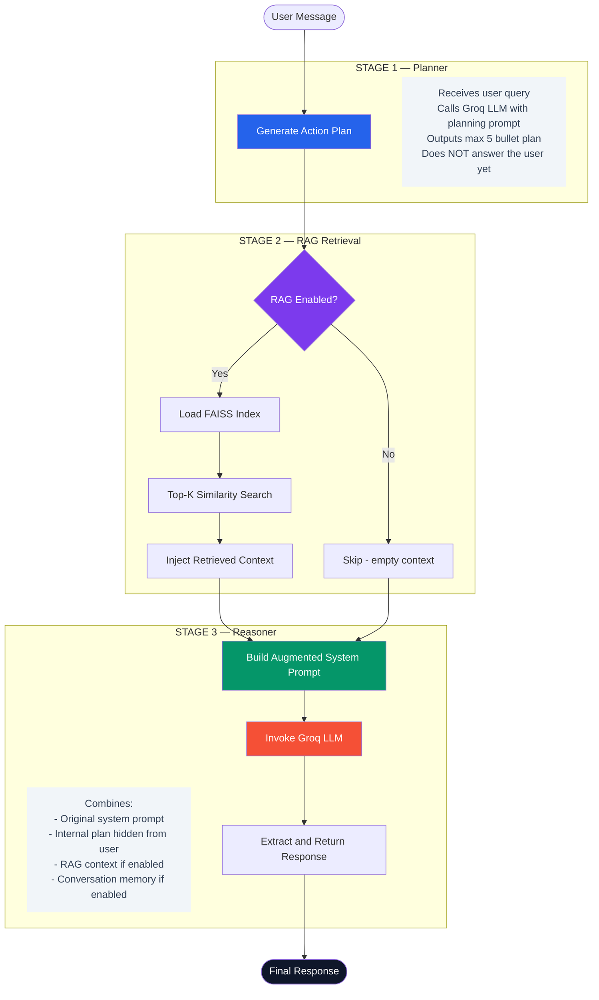
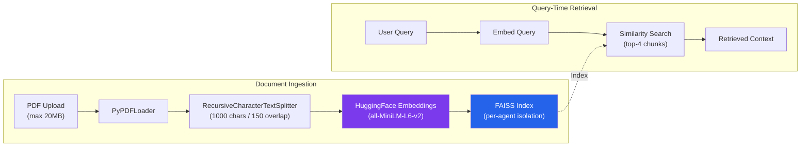
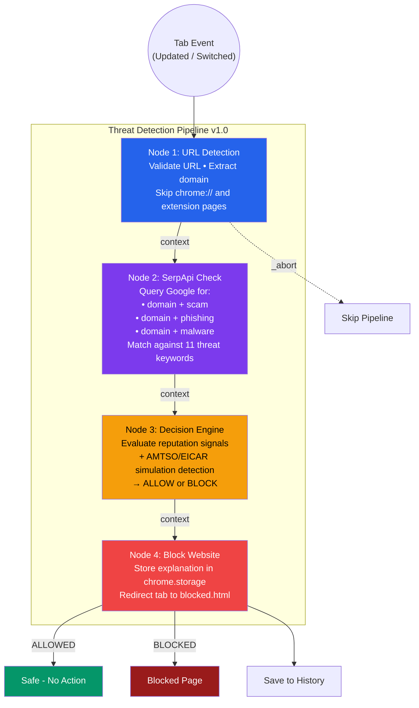
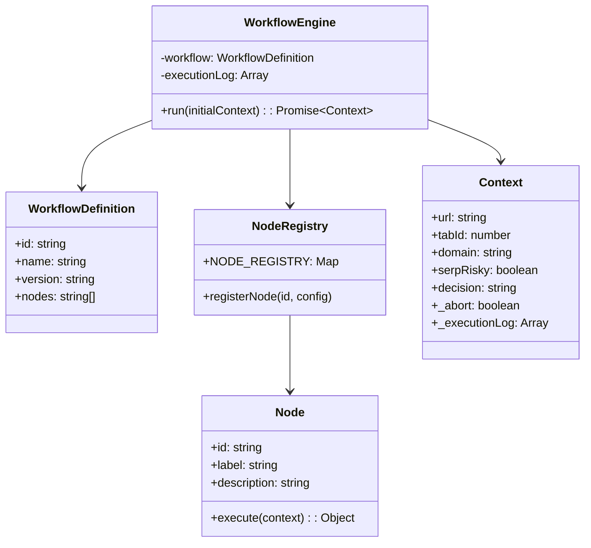
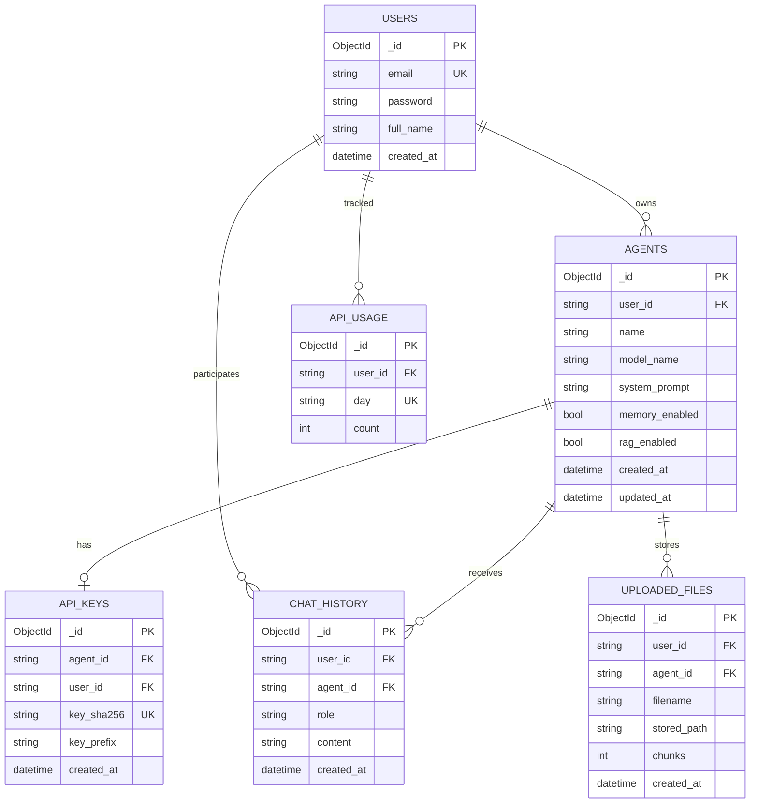
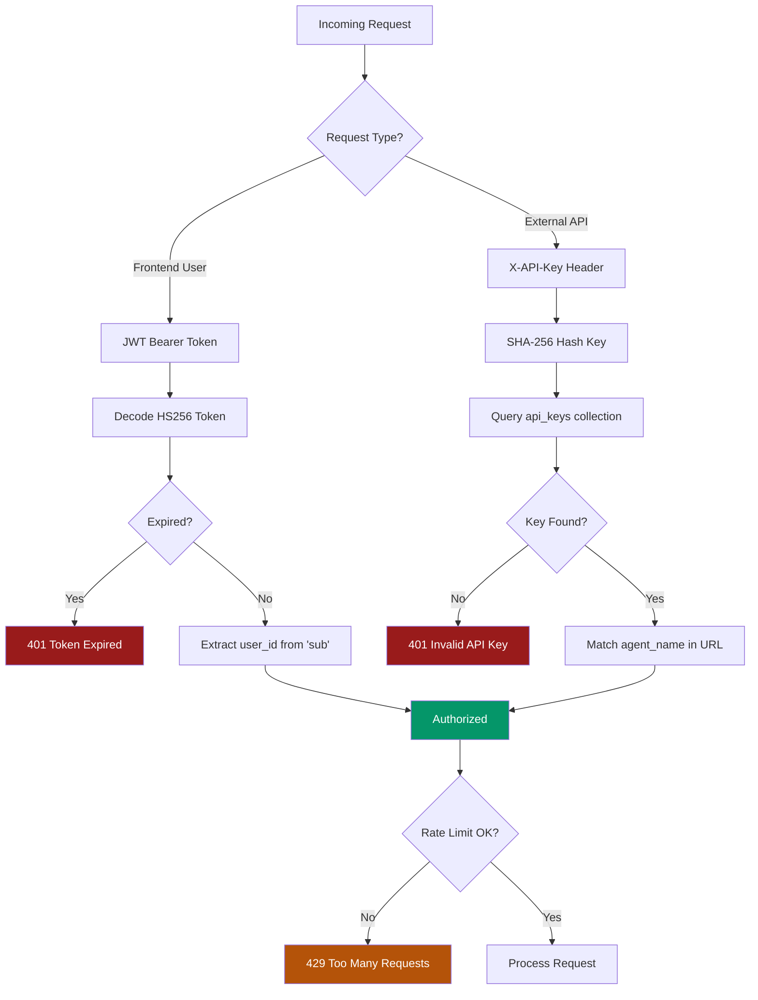

<p align="center">
 
 
 
 
 
 
 
</p>

<h1 align="center"> NeuroGuard — Agentic AI Platform</h1>

<p align="center">
 <strong>A production-grade platform to build, deploy, and manage custom AI agents — with an integrated Chrome extension for real-time web threat detection.</strong>
</p>

<p align="center">
 <em>Built by <a href="https://github.com/sabarishwaran7"><strong>Sabarishwaran</strong></a></em>
</p>

<br/>

<p align="center">
  <a href="#features">Features</a> •
  <a href="#system-architecture">Architecture</a> •
  <a href="#tech-stack">Tech Stack</a> •
  <a href="#project-structure">Project Structure</a> •
  <a href="#langgraph-agent-workflow">Agent Workflow</a> •
  <a href="#rag-pipeline">RAG Pipeline</a> •
  <a href="#neuroguard-chrome-extension">Chrome Extension</a> •
  <a href="#api-reference">API Reference</a> •
  <a href="#getting-started">Getting Started</a> •
  <a href="#deployment">Deployment</a>
</p>

---

## What is NeuroGuard?

NeuroGuard is not just another chatbot wrapper. It is a **full-stack Agentic AI Platform** that combines three powerful systems into one cohesive product:

| System | What It Does |
|--------|-------------|
| ** Agentic AI Platform** | Create, configure, and deploy custom AI agents with per-agent API keys, system prompts, model selection, and optional RAG |
| ** LangGraph Workflow Engine** | Every agent runs through a compiled multi-node state graph — `Planner → RAG Retrieval → Reasoning` — for structured, plan-and-execute intelligence |
| ** NeuroGuard Chrome Extension** | A Manifest V3 browser extension that monitors every URL in real-time using a node-based threat detection pipeline with SerpApi reputation analysis |

> **Why this matters:** This isn't a toy demo. It's architected like a real SaaS product — JWT auth, bcrypt passwords, rate limiting, API key rotation, FAISS vector stores, MongoDB indexes, Docker containers, and a polished frontend with analytics dashboards.

---

## Features

### AI Agent Management
- **Full CRUD** — Create, read, update, delete agents via REST API
- **Per-agent API keys** — Cryptographically strong (`secrets.token_hex`), SHA-256 hashed storage, prefix display, key rotation
- **Model selection** — Llama 3 8B, Llama 3 70B, Qwen QWQ 32B, DeepSeek R1 Distill via Groq LPU inference
- **Configurable system prompts** — Up to 8,000 characters per agent
- **Memory toggle** — Enable/disable conversation memory per agent
- **RAG toggle** — Enable/disable document-grounded retrieval per agent

### RAG (Retrieval-Augmented Generation)
- **PDF upload & ingestion** — Up to 20MB per file
- **Recursive text chunking** — 1,000 char chunks with 150 char overlap
- **Sentence-Transformers embeddings** — `all-MiniLM-L6-v2` (384-dim)
- **FAISS vector store** — Per-agent isolated indexes with incremental ingestion
- **Similarity search** — Top-k retrieval injected into the reasoning node

### Authentication & Security
- **JWT Bearer tokens** — HS256, 7-day expiry, `HTTPBearer` auto-extraction
- **bcrypt password hashing** — 12 rounds of salted hashing
- **Rate limiting** — SlowAPI middleware (120 req/min on chat, 30/min on login, 12/min on register)
- **CORS protection** — Configurable allowed origins via environment variables
- **API key validation** — SHA-256 digest comparison on every external agent call

### Dashboard & Analytics
- **Real-time stats** — Total agents, API calls today, recent chat activity
- **MongoDB aggregation pipelines** — Efficient per-user usage metrics
- **Daily usage tracking** — Automatic upsert-based API call counters

### NeuroGuard Chrome Extension
- **Real-time URL monitoring** — Scans every tab update and tab switch
- **SerpApi reputation check** — Queries Google for scam/phishing/malware reports
- **Automated blocking** — Redirects harmful sites to a custom blocked page
- **Threat history dashboard** — Full browsing history with risk analysis
- **n8n-inspired workflow engine** — Modular, node-based pipeline architecture

### DevOps & Deployment
- **Docker support** — Multi-stage Dockerfiles for both root and backend
- **Procfile** — Heroku/Render-ready with Uvicorn worker binding
- **Gunicorn + Uvicorn workers** — Production-grade ASGI serving
- **MongoDB Atlas** — Cloud-native database with indexed collections

---

## System Architecture



---

## Tech Stack

| Layer | Technology | Purpose |
|-------|-----------|---------|
| **Backend Framework** | FastAPI 0.115+ | Async REST API with auto-generated OpenAPI docs |
| **ASGI Server** | Uvicorn + Gunicorn | Production-grade async HTTP serving |
| **LLM Inference** | Groq Cloud (LPU) | Ultra-low-latency inference for Llama 3, Qwen, DeepSeek |
| **Agent Orchestration** | LangGraph 0.2+ | Compiled state-graph workflows with node-based execution |
| **LLM Framework** | LangChain 0.3+ | Model abstraction, document loading, text splitting |
| **Embeddings** | Sentence-Transformers | `all-MiniLM-L6-v2` for 384-dimensional dense vectors |
| **Vector Database** | FAISS (CPU) | Per-agent similarity search indexes |
| **Primary Database** | MongoDB Atlas | Users, agents, chat history, API keys, usage metrics |
| **Auth** | PyJWT + bcrypt | HS256 JWT tokens + 12-round salted password hashing |
| **Rate Limiting** | SlowAPI | IP-based request throttling per endpoint |
| **PDF Processing** | PyPDF | Document loading for RAG ingestion |
| **Frontend** | HTML5 / CSS3 / Vanilla JS | Responsive SPA with Chart.js analytics |
| **Chrome Extension** | Manifest V3 | Service worker-based background threat detection |
| **Containerization** | Docker | Multi-environment reproducible deployments |
| **Deployment** | Render / Heroku / Any PaaS | Procfile + Dockerfile for one-click deploy |

---

## Project Structure



---

## LangGraph Agent Workflow

Every chat message — whether from the frontend or an external API call — is processed through a **compiled LangGraph state machine**. This ensures structured, multi-step reasoning instead of raw single-shot LLM calls.



### Supported Models

| Model ID | Backbone | Parameters | Use Case |
|----------|----------|------------|----------|
| `llama3-8b-8192` | Llama 3 | 8B | Fast general-purpose tasks |
| `llama3-70b-8192` | Llama 3 | 70B | Complex reasoning & analysis |
| `qwen-qwq-32b` | Qwen | 32B | Multilingual & code generation |
| `deepseek-r1-distill` | DeepSeek R1 | 70B (distilled) | Advanced chain-of-thought reasoning |

---

## RAG Pipeline

The RAG system provides **per-agent document grounding** using a production-ready ingestion and retrieval pipeline.



### Key Design Decisions:
- **Per-agent isolation** — Each agent has its own FAISS index directory (`vectorstore/<agent_id>/`)
- **Incremental ingestion** — New PDFs are merged into existing indexes, not overwritten
- **Chunk metadata** — Source page numbers preserved through LangChain document objects
- **20MB upload limit** — Server-side validation before disk write

---

## NeuroGuard Chrome Extension

The extension implements a **custom n8n-inspired workflow engine** — a lightweight, node-based automation system where each node receives context, executes logic, and passes results to the next node.



### Workflow Engine Architecture



---

## API Reference

### Authentication

| Method | Endpoint | Description | Rate Limit |
|--------|----------|-------------|------------|
| `POST` | `/api/auth/register` | Register new user | 12/min |
| `POST` | `/api/auth/login` | Login & get JWT token | 30/min |
| `GET` | `/api/auth/me` | Get current user profile | — |

### Agent Management

| Method | Endpoint | Description | Auth |
|--------|----------|-------------|------|
| `POST` | `/api/agents` | Create a new agent | Bearer JWT |
| `GET` | `/api/agents` | List all user's agents | Bearer JWT |
| `GET` | `/api/agents/{id}` | Get agent details | Bearer JWT |
| `PATCH` | `/api/agents/{id}` | Update agent config | Bearer JWT |
| `DELETE` | `/api/agents/{id}` | Delete agent & all data | Bearer JWT |
| `POST` | `/api/agents/{id}/regenerate-key` | Rotate API key | Bearer JWT |

### Chat & AI

| Method | Endpoint | Description | Auth | Rate Limit |
|--------|----------|-------------|------|------------|
| `POST` | `/api/chat` | Chat with your agent | Bearer JWT | 120/min |
| `POST` | `/agent/{name}` | Public agent invocation | X-API-Key | 120/min |

### RAG Document Upload

| Method | Endpoint | Description | Auth |
|--------|----------|-------------|------|
| `POST` | `/api/agents/{id}/rag/upload` | Upload PDF for RAG | Bearer JWT |

### Dashboard

| Method | Endpoint | Description | Auth |
|--------|----------|-------------|------|
| `GET` | `/api/dashboard/stats` | Get dashboard metrics | Bearer JWT |

### NeuroGuard Extension

| Method | Endpoint | Description |
|--------|----------|-------------|
| `POST` | `/api/neuroguard/history` | Add browsing history entry |
| `GET` | `/api/neuroguard/history` | Get all history entries |
| `DELETE` | `/api/neuroguard/history` | Clear all history |
| `GET` | `/api/neuroguard/stats` | Get aggregated threat stats |
| `GET` | `/api/extension/download` | Download extension as ZIP |

### Usage Example — External Agent API

```bash
curl -X POST https://your-api.com/agent/resume_builder \
 -H "X-API-Key: Aiml_agent_72a6a8a722760b271e386586..." \
 -H "Content-Type: application/json" \
 -d '{"message": "Build a resume for a senior ML engineer"}'
```

**Response:**
```json
{
 "reply": "Here's a professional resume for a Senior ML Engineer...",
 "agent_name": "resume_builder",
 "used_rag": false,
 "used_memory": true
}
```

---

## Database Schema



---

## Getting Started

### Prerequisites

| Tool | Version | Purpose |
|------|---------|---------|
| Python | 3.11+ | Backend runtime |
| MongoDB | 6.0+ or Atlas | Primary database |
| Groq API Key | — | LLM inference |
| SerpApi Key | — | Chrome extension (optional) |

### 1. Clone the Repository

```bash
git clone https://github.com/sabarishwaran7/Neuroguard-api-dev.git
cd Neuroguard-api-dev
```

### 2. Set Up Environment Variables

Create a `.env` file in the `backend/` directory:

```env
# 
# NeuroGuard — Environment Configuration
# 

# MongoDB
MONGO_URI=mongodb+srv://<user>:<password>@cluster.mongodb.net/?retryWrites=true
MONGO_DB=agentic_platform

# Authentication
JWT_SECRET=your-super-secret-jwt-key-change-this

# Groq LLM
GROQ_API_KEY=gsk_your_groq_api_key_here

# CORS (comma-separated origins)
CORS_ORIGINS=http://localhost:8000,http://127.0.0.1:8000

# Optional overrides
# UPLOADS_DIR=/custom/path/to/uploads
# VECTORSTORE_DIR=/custom/path/to/vectorstore
# FRONTEND_DIR=/custom/path/to/frontend
# HF_EMBED_MODEL=sentence-transformers/all-MiniLM-L6-v2
```

### 3. Install Dependencies

```bash
cd backend
pip install -r requirements.txt
```

### 4. Run the Server

```bash
uvicorn main:app --host 0.0.0.0 --port 8000 --reload
```

The application will be live at **`http://localhost:8000`** with:
- Landing page at `/`
- Dashboard at `/dashboard`
- Chat at `/chat`
- API docs at `/docs` (auto-generated by FastAPI)

### 5. Install Chrome Extension (Optional)

1. Navigate to `chrome://extensions/`
2. Enable **Developer mode**
3. Click **Load unpacked**
4. Select the `chrome-extension/` directory
5. Add your SerpApi key in `config.js`

---

## Deployment

### Docker

```bash
# From project root
docker build -t neuroguard .
docker run -p 10000:10000 --env-file backend/.env neuroguard
```

### Backend-only Docker

```bash
cd backend
docker build -t neuroguard-backend .
docker run -p 8000:8000 --env-file .env neuroguard-backend
```

### Render / Heroku

The project includes a `Procfile` for instant PaaS deployment:

```
web: uvicorn main:app --host 0.0.0.0 --port ${PORT:-8000}
```

Simply connect your Git repo and set the environment variables in the platform dashboard.

---

## Roadmap

The platform is designed with extensibility in mind. Reserved extension points are already defined in the codebase:

| Feature | Status | Description |
|---------|--------|-------------|
| Multi-Agent Orchestration | Planned | Supervisor graphs, agent handoffs |
| Voice Agents | Planned | Streaming STT/TTS, telephony bridges |
| Vision Agents | Planned | Image/video tools, multimodal messages |
| Browser Agents | Planned | Headless automation, policy sandboxes |
| Agent Marketplace | Planned | Templates, versioning, publishing |
| Team Collaboration | Planned | Workspaces, RBAC, audit trails |

---

## Testing

Run the included integration test to verify your setup:

```bash
cd backend
python test.py
```

This sends a test message to a running agent and prints the response.

---

## Security Model



---

## Contributing

Contributions are welcome! Please feel free to submit a Pull Request. For major changes, please open an issue first to discuss what you would like to change.

1. Fork the repository
2. Create your feature branch (`git checkout -b feature/amazing-feature`)
3. Commit your changes (`git commit -m 'feat: add amazing feature'`)
4. Push to the branch (`git push origin feature/amazing-feature`)
5. Open a Pull Request

---

## License

This project is open source and available under the [MIT License](LICENSE).

---

<p align="center">
  <strong>Built by <a href="https://github.com/sabarishwaran7">Sabarishwaran</a></strong>
  <br/>
  <sub>If this project helped you, consider giving it a star</sub>
</p>
